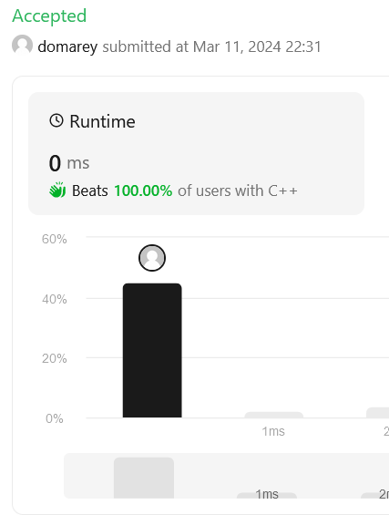

# 0791. Custom Sort String

# Overview
- [Description](#description)
  - [Example 1](#example-1)
  - [Example 2](#example-2)
  - [Constraints](#constraints)
- [Solution explanation](#solution-explanation)

# Description
Original [here](https://leetcode.com/problems/custom-sort-string/description/).

You are given two strings `order` and `s`. All the characters of `order` are unique and were sorted in some custom order previously.

Permute the characters of `s` so that they match the order that `order` was sorted. More specifically, if a character `x` occurs before a character `y` in order, then `x` should occur before `y` in the permuted string.

Return any permutation of `s` that satisfies this property.


### Example 1:
- Input:
  ```
  order = "cba"
  s = "abcd" 
  ```
  
- Output:
  ```
  "cbad"
  ```

### Example 2:
- Input:
  ```
  order = "bcafg"
  s = "abcd" 
  ```
  
- Output:
  ```
  "bcad"
  ```

### Constraints:
  - $10 <=$ `low` $<=$ `high` $<= 10^9$
  - $1 <=$ `order.length` $<= 26$;
  - $1 <=$ `s.length` $<= 200$;
  - `order` and `s` consist of lowercase English letters;
  - All the characters of `order` are **unique**.


# Solution explanation
Beats 100% of the users:



