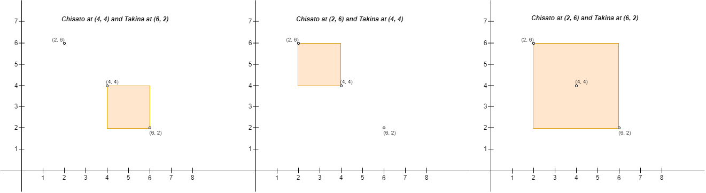

# 3025. Find the Number of Ways to Place People I

# Overview
- [Description](#description)
  - [Example 1](#example-1)
  - [Example 2](#example-2)
  - [Constraints](#constraints)
- [Solution explanation](#solution-explanation)

# Description
Original [here](https://leetcode.com/problems/find-the-number-of-ways-to-place-people-i/description/).

You are given a 2D array `points` of size `n x 2` representing integer coordinates of some points on a 2D-plane, where `points[i] = [x_i, y_i]`.

We define the right direction as positive x-axis (increasing x-coordinate) and the left direction as negative x-axis (decreasing x-coordinate). Similarly, we define the up direction as positive y-axis (increasing y-coordinate) and the down direction as negative y-axis (decreasing y-coordinate)

You have to place `n` people, including Chisato and Takina, at these points such that there is exactly one person at every point. Chisato wants to be alone with Takina, so Chisato will build a rectangular fence with **Chisato**'s position as the **upper left** corner and **Takina**'s position as the **lower right** corner of the fence (Note that the fence *might **not** enclose any area*, i.e. it can be a **line**). If any person other than Chisato and Takina is either inside the fence or on the fence, Chisato will be sad.

Return the number of pairs of points where you can place Chisato and Takina, such that Chisato does not become sad on building the fence.

### Example 1:
- Input:
  
  ```
  points = [[1,1],[2,2],[3,3]]
  ```
- Output:
  ```
  [1,3,5,6,2,4]
  ```

### Example 2:
- Input:
  ```
  root = [1,null,2,3,4,5,null,null,6,7,null,8,null,9,10,null,null,11,null,12,null,13,null,null,14]
  ```
  
- Output:
  ```
  [1,2,3,6,7,11,14,4,8,12,5,9,13,10]
  ```
  
  ### Constraints:

